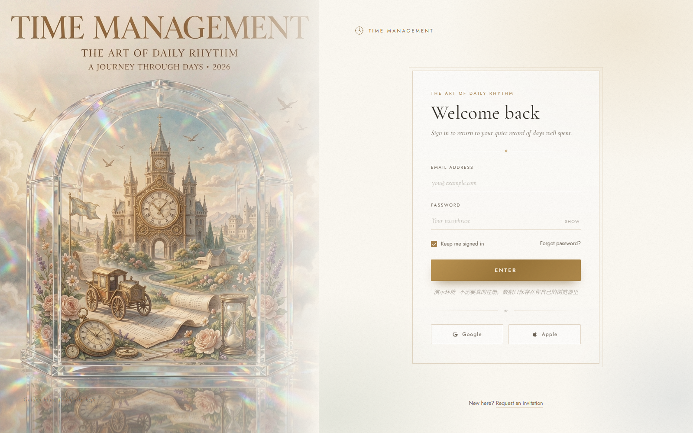
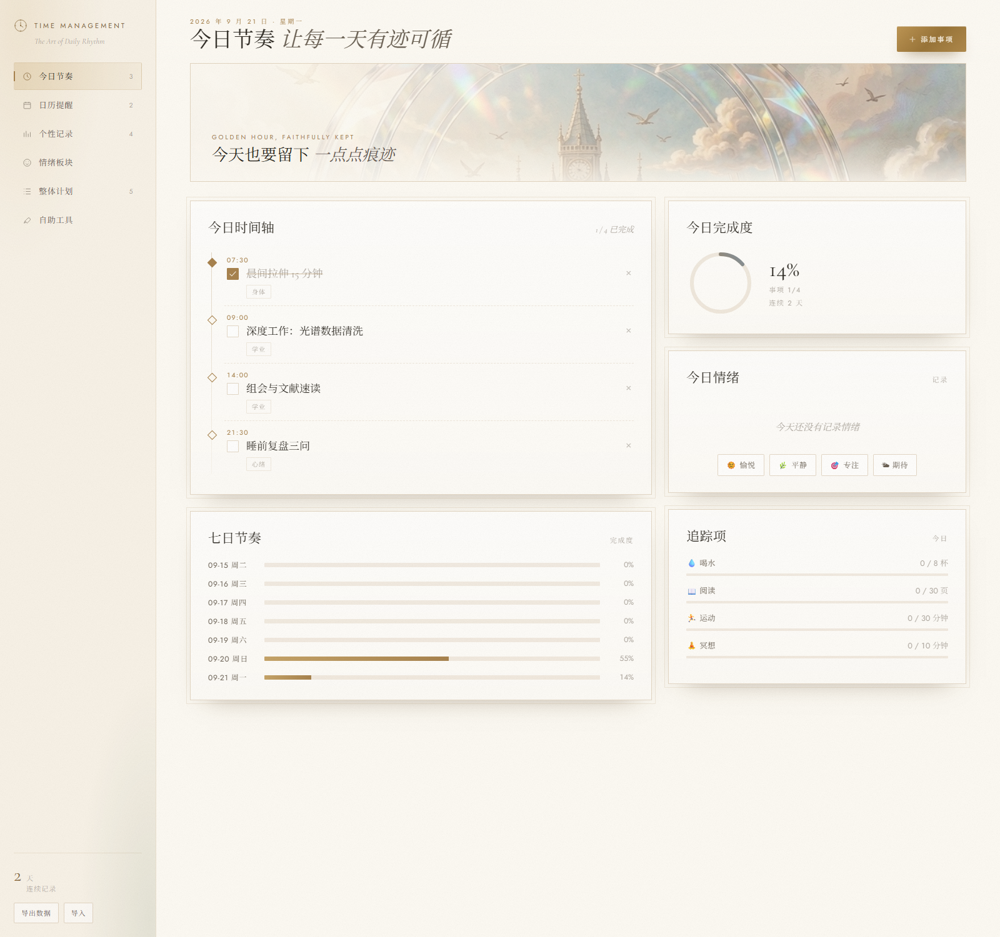
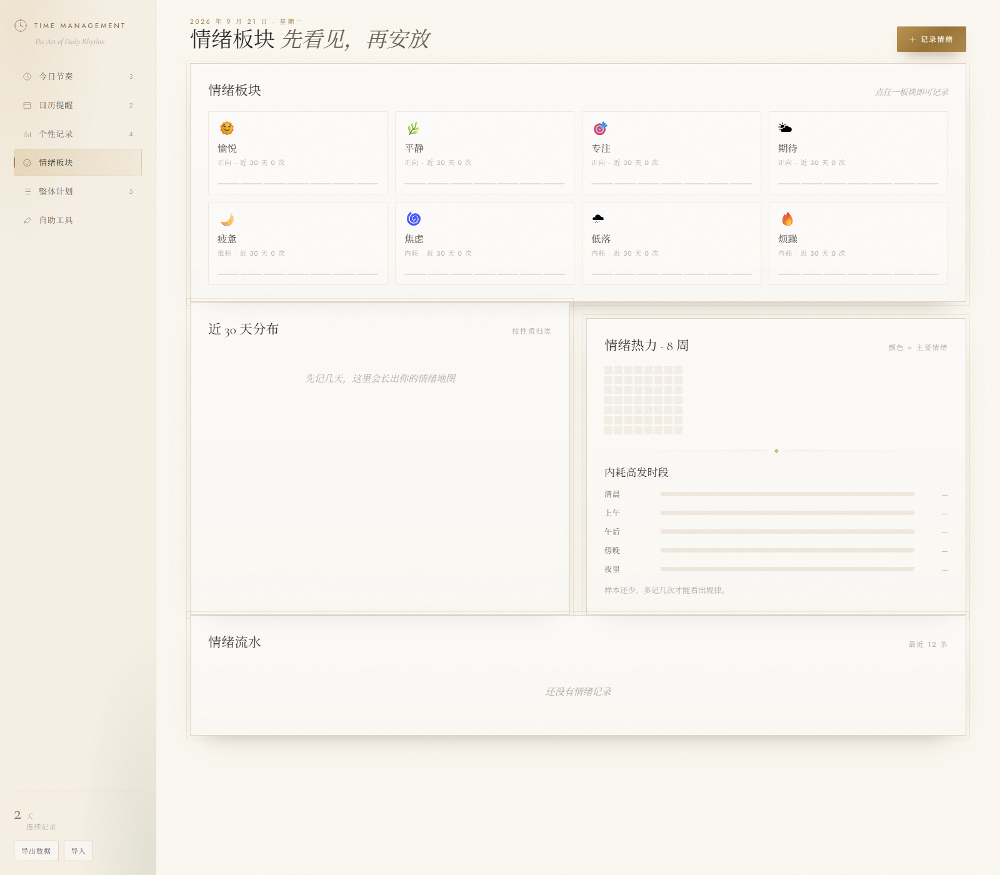
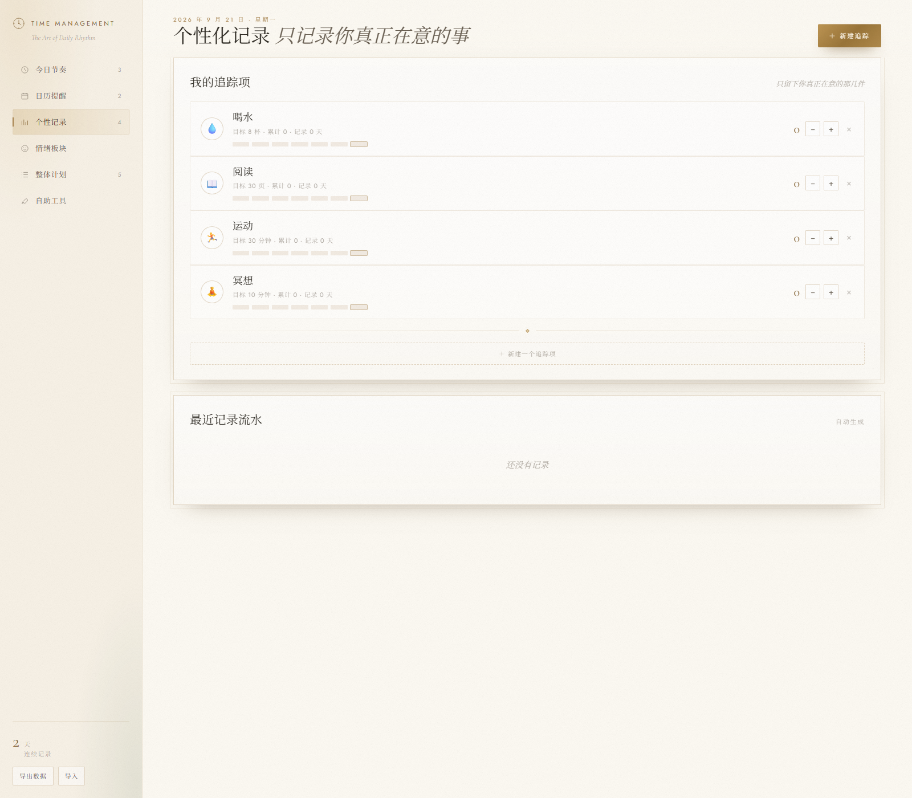
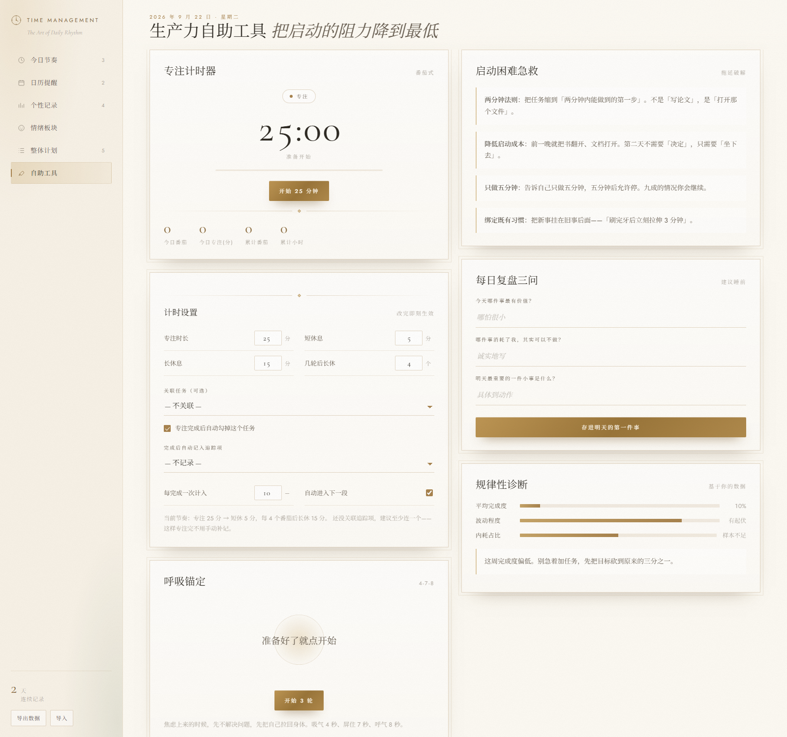

# Time Management

**The Art of Daily Rhythm** — 一个复古杂志风格的私人时间管理工具，单文件前端，打开即用。

> 面向"想变规律但总是坚持不下来"的普通人做的：**不追求功能多，追求每天都愿意打开**。

<p align="center">
  
</p>

---

## 在线体验

| | 链接 |
|---|---|
| 登录页（入口） | https://jerry-hao-max.github.io/time-management/ |
| 直接进应用 | https://jerry-hao-max.github.io/time-management/app.html |

不需要注册。**所有数据只存在你自己的浏览器 `localStorage` 里，不上传任何服务器。**

---

## 它解决什么

大多数时间管理工具的问题不是功能不够，而是**用了三天就卸载**。这个项目针对四个具体卡点设计：

| 卡点 | 对应做法 |
|---|---|
| 做事难保持规律 | 「今日节奏」时间轴 + 完成度圆环 + **七日对比**；工具页的「规律性诊断」直接算完成度均值和**波动标准差**，波动大就建议你固定时间而不是提高强度 |
| 很难记录日常 | 勾选式时间轴，一件事一行，降低记录成本 |
| 个性化记录 | 「个性记录」里完全自建追踪项：自己定图标、名称、每日目标、单位，加减即记，带周条和流水 |
| 情绪分门别类 | 8 种情绪归入**正向 / 低耗 / 内耗**三类板块，配 8 周热力图，并做**内耗高发时段**分析（按录入时间聚合，直接告诉你「傍晚内耗比例偏高」） |

另外还有**整体计划**（年/季/月/周四层）和**生产力自助工具**（番茄钟、4-7-8 呼吸引导、启动困难急救、每日复盘三问）。

---

## 六个板块

| 板块 | 内容 |
|---|---|
| 今日节奏 | 时间轴任务、完成度圆环、七日完成度、今日情绪、追踪项进度 |
| 日历提醒 | 月历（事项/情绪/追踪/提醒四色圆点 + 完成度细条）、当日详情、提醒增删启停 |
| 个性记录 | 自建追踪项、周条、最近记录流水 |
| 情绪板块 | 情绪录入（主情绪 + 强度 + 诱因标签 + 备注）、30 天分布、8 周热力图、内耗时段分析 |
| 整体计划 | 年 / 季 / 月 / 周 四层计划，可步进调整进度 |
| 自助工具 | 番茄钟、呼吸锚定、启动困难急救、复盘三问、规律性诊断 |

<table>
<tr>
<td></td>
<td></td>
</tr>
<tr>
<td></td>
<td></td>
</tr>
</table>

---

## 本地运行

没有构建步骤，没有依赖。但**建议用本地服务打开**：

```bash
git clone https://github.com/Jerry-hao-max/time-management.git
cd time-management
python -m http.server 8000
# 打开 http://127.0.0.1:8000/
```

> 直接双击 `index.html` 用 `file://` 打开也能看，但部分浏览器会限制 `localStorage`，**页面能显示、数据却存不下来**。用上面的本地服务最稳。

---

## 技术说明

- **纯前端单文件**，`app.html` 约 1700 行，零依赖、零构建、零后端
- 数据存 `localStorage`，支持**导出/导入 JSON** 手动备份
- 提醒基于浏览器通知 API，按设定的「周几 + 时刻」触发，页面需保持打开
- 加了 hash 路由：`app.html#mood`、`app.html#plan` 可直接跳转到对应板块
- 视觉体系：奶油 / 香槟 / 古铜 / 鼠尾草 / 灰蓝，标题 Cormorant Garamond + 正文 Jost，玻璃质感卡片 + 胶片颗粒

## 已知限制

- 没有账号系统，换浏览器/设备数据不互通（这是刻意的：不做云端就没人能看到你的记录）
- 提醒依赖页面开着，关掉页面就收不到
- 情绪分析是简单启发式（按录入时间分桶），不是严谨的统计模型
- 示例数据是预置的，可以随时删掉

## 欢迎反馈

这个项目最想知道的是：**你会不会用超过三天？如果不会，是哪里劝退了你？**

- 有想法 / 发现 bug → 直接开 [Issue](https://github.com/Jerry-hao-max/time-management/issues)
- 功能建议也欢迎，尤其"哪个板块太多余、哪个又不够用"

---

## 中文速览

一个复古杂志风格的私人时间管理工具，纯前端、无后端、数据只存本地。

六大板块：今日节奏 / 日历提醒 / 个性记录 / 情绪板块 / 整体计划 / 自助工具。

重点解决"坚持不下来"：不只记录，还用**七日波动**和**内耗时段**这种反推的方式，告诉你问题出在节奏还是出在时间点。

只想看效果的话，直接开 https://jerry-hao-max.github.io/time-management/ 。
